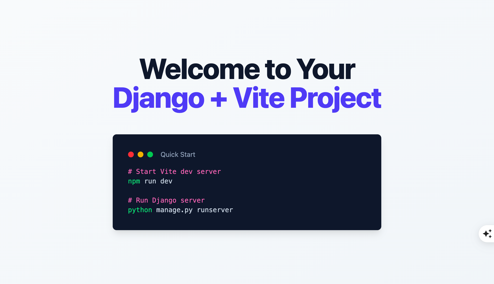

# Installation

```bash
$ pip install Django
$ django-admin startproject example
$ cd example
```

Now your Django projects would seem like this:

```
├── manage.py
└── example
    ├── __init__.py
    ├── asgi.py
    ├── settings.py
    ├── urls.py
    └── wsgi.py
```

Next, install package

```bash
$ pip install django-vite-boilerplate
```

Add `django_vite_boilerplate` and `django_vite` to the `INSTALLED_APPS` in `example/settings.py`

```python
INSTALLED_APPS = [
    'django.contrib.admin',
    'django.contrib.auth',
    'django.contrib.contenttypes',
    'django.contrib.sessions',
    'django.contrib.messages',
    'django.contrib.staticfiles',
    'django_vite',                        # new
    'django_vite_boilerplate',            # new
]
```

Add code below to Django settings `example/settings.py`

```python
STATICFILES_DIRS = [
    BASE_DIR / "public/static"
]

DJANGO_VITE = {
    "default": {
        "dev_mode": DEBUG,
        "dev_server_port": 3036,
        "manifest_path": BASE_DIR / "public/static/.vite/manifest.json",
    },
}
```

Let's run Django command to create frontend project from the templates

```bash
$ python manage.py vite_init
    project_slug (frontend):
```

Now a new `frontend` directory is created which contains pre-defined files for our frontend project.

```bash
├── frontend
│   ├── application
├── manage.py
├── package-lock.json
├── package.json
├── vite_django_config.json
├── vite.config.js
└── requirements.txt
```

## Frontend

:::{note}
If you have no nodejs installed, please install it first by using below links

1. On [nodejs homepage](https://nodejs.org/en/download/)
1. Using [nvm](https://github.com/nvm-sh/nvm) I recommend this way.
:::

```bash
# make sure node is available
$ node -v

# install dependency packages
$ npm install

$ npm run dev

  ➜  Local:   http://localhost:3036/static/
  ➜  press h + enter to show help
```

## Load the bundle files

Let's do a quick test on the home page.

Update `example/urls.py`

```python hl_lines="6"
from django.contrib import admin
from django.urls import path
from django.views.generic import TemplateView

urlpatterns = [
    path('', TemplateView.as_view(template_name="index.html")),     # new
    path('admin/', admin.site.urls),
]
```

```bash hl_lines="9"
$ mkdir example/templates

├── frontend
├── manage.py
└── example
    ├── __init__.py
    ├── asgi.py
    ├── settings.py
    ├── templates
    ├── urls.py
    └── wsgi.py
```

Update `TEMPLATES` in `example/settings.py`, so Django can know where to find the templates

```python hl_lines="4"
TEMPLATES = [
    {
        'BACKEND': 'django.template.backends.django.DjangoTemplates',
        'DIRS': ['example/templates'],       # new
        'APP_DIRS': True,
        'OPTIONS': {
            'context_processors': [
                'django.template.context_processors.debug',
                'django.template.context_processors.request',
                'django.contrib.auth.context_processors.auth',
                'django.contrib.messages.context_processors.messages',
            ],
        },
    },
]
```

Add `index.html` to the above `example/templates`

```html


<!DOCTYPE html>
<html lang="en">
<head>
    <meta charset="UTF-8">
    <meta name="viewport" content="width=device-width, initial-scale=1.0">
    <title>Welcome - Django + Vite + Tailwind</title>
    
    
</head>
<body class="bg-gradient-to-br from-slate-50 to-slate-100 min-h-screen flex items-center justify-center">
    <!-- Hero Section -->
    <main class="max-w-4xl mx-auto px-4 sm:px-6 lg:px-8 py-12 text-center">
        <h2 class="text-4xl font-extrabold text-slate-900 sm:text-5xl sm:tracking-tight lg:text-6xl">
            Welcome to Your
            <span class="block text-indigo-600">Django + Vite Project</span>
        </h2>

        <div class="bg-slate-900 rounded-lg shadow-lg p-8 mt-12 text-left">
            <div class="flex items-center mb-4">
                <div class="flex space-x-2">
                    <div class="w-3 h-3 rounded-full bg-red-500"></div>
                    <div class="w-3 h-3 rounded-full bg-yellow-500"></div>
                    <div class="w-3 h-3 rounded-full bg-green-500"></div>
                </div>
                <span class="ml-4 text-slate-400 text-sm">Quick Start</span>
            </div>
            <pre class="text-slate-300 text-sm overflow-x-auto"><code><span class="text-pink-400"># Start Vite dev server</span>
<span class="text-green-400">npm</span> run dev

<span class="text-pink-400"># Run Django server</span>
<span class="text-green-400">python</span> manage.py runserver</code></pre>
        </div>
    </main>
</body>
</html>
```

1. We `load django_vite` at the top of the template
2. `` to load js and relevant css files

## Manual Test

```bash
$ npm run dev

$ python manage.py migrate
$ python manage.py runserver
```

Now check on [http://127.0.0.1:8000/](http://127.0.0.1:8000/) and you should be able to see a welcome page.

In the devtools console, you should see

```bash
👋 Hello World from django-vite-boilerplate
```

## Preview


